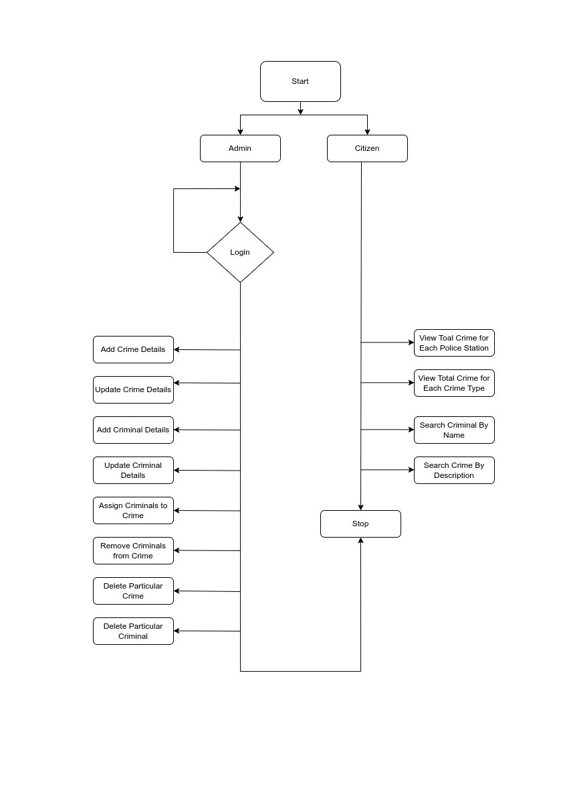

**# puny-leather-5605**
# Crime Information Management System

**Probem Statement:**  
The main objective of this system is to maintain and manage detailed information on the
crime that happened in an area under a particular police station.

                                                      
**Users of this application:**   
• Citizens  
• Administrator

**Roles of Citizens** 
1)  Citizens Can view total crime for each police station area for a date range.  
2) Citizen Can view total crime for each crime type for a date range.
3) Citizens Can search for criminal by name.
4) Citizens Can search for crime by description.

**Roles of Admin** 
1) Login his username and password. 
2) Add Crime Details.
3) Update Crime Details.
4) Add Criminal Details.
5) Update Criminal Details.
6) Assign Criminals to Crime.
7) Remove Criminals from Crime.
8) Delete particular Crime.
9) Delete Particular Criminal.
10) Logout from Account.

# Relation of Database
------------------
#### **ER Diagram** 

------------------
# Flow of Project
#### **Flow Diagram**

[Video Link](https://drive.google.com/drive/folders/1TwH_HC35iOmNbGDVx_hDW-0mT_TBDUTM)
